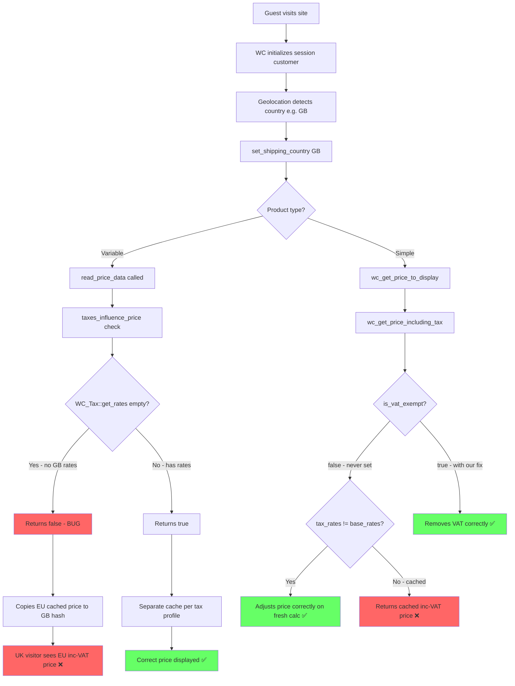
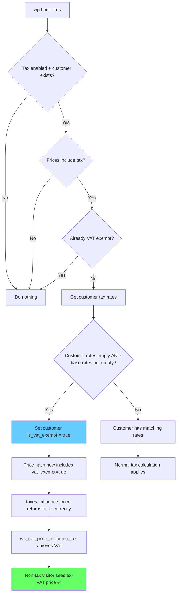

# WooCommerce 10.4+ Geolocation Tax/Price Display Bug — Root Cause Analysis & Fix Plan

## Summary

WooCommerce 10.4.0 introduced a new method [`taxes_influence_price()`](wp-content/plugins/woocommerce/includes/data-stores/class-wc-product-variable-data-store-cpt.php:534) that creates a **price caching shortcut** for variable products. This method incorrectly determines that taxes don't influence the price for customers geolocated to non-tax countries, causing cached EU-inclusive prices to be served to UK/USA/non-EU visitors.

For simple products, the issue is different but related: [`wc_get_price_including_tax()`](wp-content/plugins/woocommerce/includes/wc-product-functions.php:1415) checks `WC()->customer->get_is_vat_exempt()` to decide whether to strip VAT — but WooCommerce **never automatically sets `is_vat_exempt` to true** based on geolocation. It relies on `WC_Tax::get_rates()` returning empty rates for the customer's country, which then causes the `$tax_rates !== $base_tax_rates` branch to handle the price adjustment. The bug manifests when the price is cached before this branch executes.

## Affected WooCommerce Versions

- 10.4.0+ — introduced [`taxes_influence_price()`](wp-content/plugins/woocommerce/includes/data-stores/class-wc-product-variable-data-store-cpt.php:534)
- 10.5.0+ — changed price hash serialization algorithm via PR #61286
- Current version: **10.5.2**

## The Complete Code Flow

### 1. Geolocation → Customer Country

```
Settings: woocommerce_default_customer_address = 'geolocation' or 'geolocation_ajax'
```

1. Guest visits site → [`WC()->initialize_cart()`](wp-content/plugins/woocommerce/includes/class-woocommerce.php:1083) creates `new WC_Customer(0, true)` — a session-based customer
2. The `$is_session = true` flag loads [`WC_Customer_Data_Store_Session`](wp-content/plugins/woocommerce/includes/data-stores/class-wc-customer-data-store-session.php:107)
3. [`set_defaults()`](wp-content/plugins/woocommerce/includes/data-stores/class-wc-customer-data-store-session.php:149) calls [`wc_get_customer_default_location()`](wp-content/plugins/woocommerce/includes/wc-core-functions.php:1354)
4. That function calls [`wc_get_customer_geolocation()`](wp-content/plugins/woocommerce/includes/wc-core-functions.php:1308) → `WC_Geolocation::geolocate_ip()`
5. The geolocated country is set on the customer via `set_billing_country()` and `set_shipping_country()`

**Result**: For a UK visitor, `WC()->customer->get_shipping_country()` = `'GB'`

### 2. Customer Country → Tax Rates

[`WC_Tax::get_rates()`](wp-content/plugins/woocommerce/includes/class-wc-tax.php:482) calls [`get_tax_location()`](wp-content/plugins/woocommerce/includes/class-wc-tax.php:454) which calls `$customer->get_taxable_address()` → returns the geolocated country.

For a UK customer with an EU shop that only has EU tax rates configured:
- `WC_Tax::get_rates()` returns **empty array** — no matching tax rates for GB
- `WC_Tax::get_base_tax_rates()` returns the **EU VAT rate** — e.g. 21%

### 3. The Bug in Variable Products — `taxes_influence_price()`

```php
// class-wc-product-variable-data-store-cpt.php:534
protected function taxes_influence_price( $product ): bool {
    if ( ! $product->is_taxable() ) {
        return false;
    }
    if ( empty( WC_Tax::get_rates( $product->get_tax_class() ) ) ) {
        return false;  // ← BUG: Returns false for UK visitors!
    }
    if ( ! empty( WC()->customer ) && WC()->customer->get_is_vat_exempt() ) {
        return false;
    }
    return true;
}
```

**The problem**: When `WC_Tax::get_rates()` returns empty for a UK visitor, this method returns `false`, meaning "taxes don't influence the price". This causes:

```php
// line 292
$opposite_price_hash = $this->taxes_influence_price( $product ) ? null : $this->get_price_hash( $product, ! $for_display );
```

When `taxes_influence_price()` returns `false`, WooCommerce calculates `$opposite_price_hash` and **stores the same prices for both the display and non-display hash**. If an EU visitor's tax-inclusive prices were cached first, the UK visitor gets those same cached prices.

### 4. The Bug in Simple Products

For simple products, [`wc_get_price_including_tax()`](wp-content/plugins/woocommerce/includes/wc-product-functions.php:1415) has this logic when prices include tax:

```php
if ( ! empty( WC()->customer ) && WC()->customer->get_is_vat_exempt() ) {
    // Remove taxes — but is_vat_exempt is NEVER set by geolocation!
} elseif ( $tax_rates !== $base_tax_rates && apply_filters( 'woocommerce_adjust_non_base_location_prices', true ) ) {
    // Adjust prices for non-base locations — THIS is the correct path for UK visitors
}
```

The `elseif` branch correctly handles the case where `$tax_rates` is empty and `$base_tax_rates` has the EU rate. **However**, if the price was already cached from a page-cached response, the AJAX call may not recalculate it properly.

### 5. The `get_price_hash()` Issue

```php
// line 560
protected function get_price_hash( &$product, $for_display = false ) {
    $price_hash = array( false );
    if ( $for_display && wc_tax_enabled() ) {
        $price_hash = array(
            get_option( 'woocommerce_tax_display_shop', 'excl' ),
            WC_Tax::get_rates(),           // Empty for UK visitor
            WC()->customer->is_vat_exempt(), // false — never set by geolocation
        );
    }
    // ...
}
```

For a UK visitor: hash = `['incl', [], false]`
For an EU visitor: hash = `['incl', [rate_id => {rate: 21, ...}], false]`

These ARE different hashes, so in theory they should cache separately. **But** the `taxes_influence_price()` shortcut at line 292 bypasses this by copying the EU price into the UK hash slot.

## Root Cause Summary

The bug has **two layers**:

1. **Primary — `taxes_influence_price()` in WC 10.4+**: Returns `false` when customer tax rates are empty, causing price cache entries to be shared between taxed and non-taxed visitors
2. **Secondary — `is_vat_exempt` is never set by geolocation**: WooCommerce does not automatically mark customers as VAT exempt based on their geolocated country having no tax rates. The system relies on the `$tax_rates !== $base_tax_rates` comparison in price functions, but the new caching shortcut bypasses this

## Fix Strategy

### Fix 1: Set `is_vat_exempt` based on customer location — hook into `wp`

The most robust fix is to **detect when a customer has no applicable tax rates and set them as VAT exempt**. This fixes both variable and simple products, and makes `is_vat_exempt()` return the correct value everywhere. The fix applies regardless of how the customer's location was determined — geolocation, manual address change at checkout, or session data.

```php
add_action( 'wp', 'ssap_maybe_set_vat_exempt_from_geolocation', 20 );

function ssap_maybe_set_vat_exempt_from_geolocation() {
    // Only for frontend, non-admin, when tax is enabled
    if ( is_admin() || ! wc_tax_enabled() || ! WC()->customer ) {
        return;
    }

    // Only when prices include tax
    if ( ! wc_prices_include_tax() ) {
        return;
    }

    // Check if customer has any applicable tax rates
    $tax_rates = WC_Tax::get_rates( '' );
    $base_tax_rates = WC_Tax::get_base_tax_rates( '' );

    // If customer has no tax rates but the base location does, they should be VAT exempt
    if ( empty( $tax_rates ) && ! empty( $base_tax_rates ) ) {
        WC()->customer->set_is_vat_exempt( true );
    }
}
```

### Fix 2: Fix the price hash for variable products

Additionally, ensure the variation price hash always includes the customer's tax location context:

```php
add_filter( 'woocommerce_get_variation_prices_hash', 'ssap_fix_variation_prices_hash', 99, 3 );

function ssap_fix_variation_prices_hash( $price_hash, $product, $for_display ) {
    if ( ! WC()->customer ) {
        return $price_hash;
    }

    // Always include VAT exempt status and tax-relevant location
    $price_hash[] = (int) WC()->customer->get_is_vat_exempt();
    $price_hash[] = WC()->customer->get_shipping_country();
    $price_hash[] = WC()->customer->get_shipping_state();

    return $price_hash;
}
```

### Workaround: Add 0% tax rates for non-EU countries

Yes, adding 0% tax rate rows for GB, US, CA, etc. would work as a workaround because:
- `WC_Tax::get_rates()` would return a rate — `{rate: 0, ...}` instead of empty
- `taxes_influence_price()` would return `true` — because rates are not empty
- The price hash would be different for each country
- The price calculation would correctly compute 0% tax

**However**, this is impractical for stores selling worldwide — you'd need entries for 200+ countries.

## Implementation Plan for Super Speedy AJAX Prices Plugin

### Changes to `includes/class-wc-ajax-pricing.php`:

1. **Add the VAT exempt detection hook** in the `init()` method
2. **Update the existing `add_user_context_to_variation_prices_hash` method** to also include the VAT exempt status after our fix sets it
3. **Add the AJAX handler context** — ensure the VAT exempt flag is also set during AJAX price requests

### Files to modify:
- [`wp-content/plugins/super-speedy-ajax-prices/includes/class-wc-ajax-pricing.php`](wp-content/plugins/super-speedy-ajax-prices/includes/class-wc-ajax-pricing.php)

## Mermaid Diagram — Price Calculation Flow



## Mermaid Diagram — The Fix


